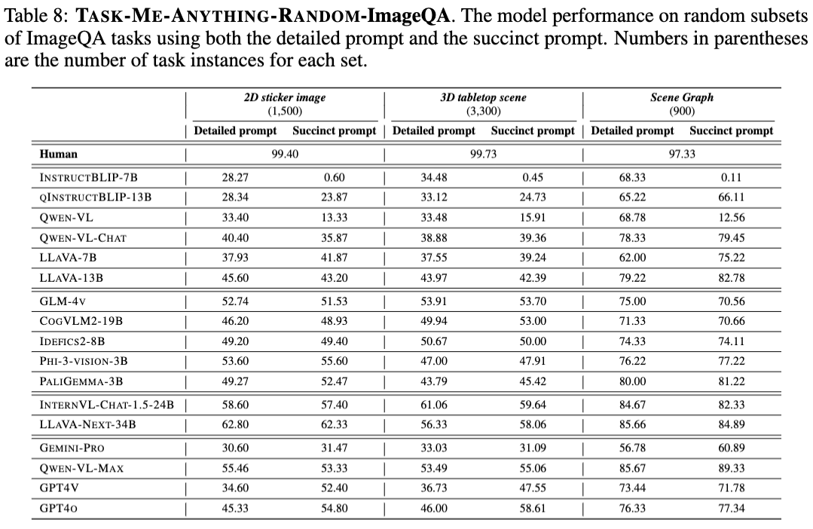
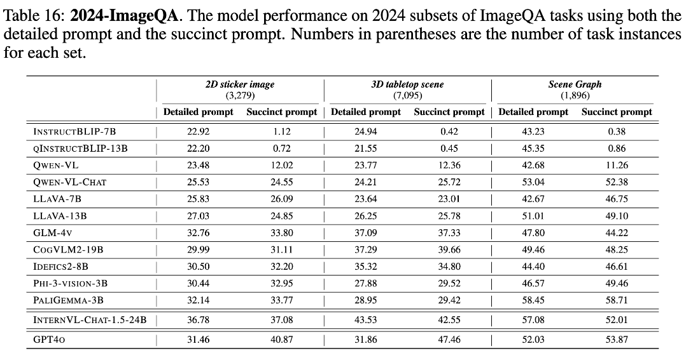
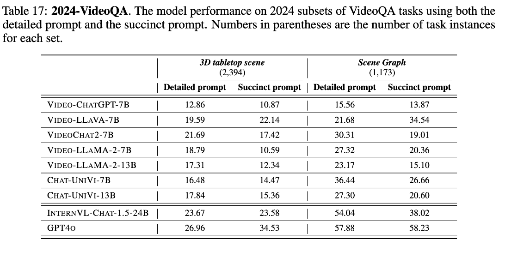
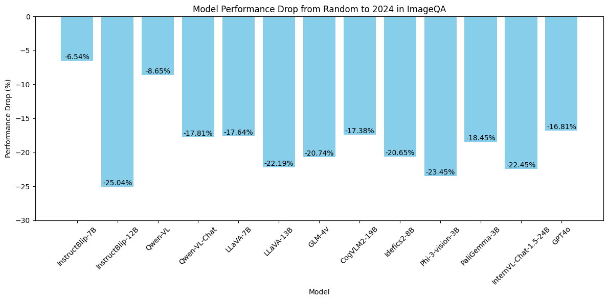
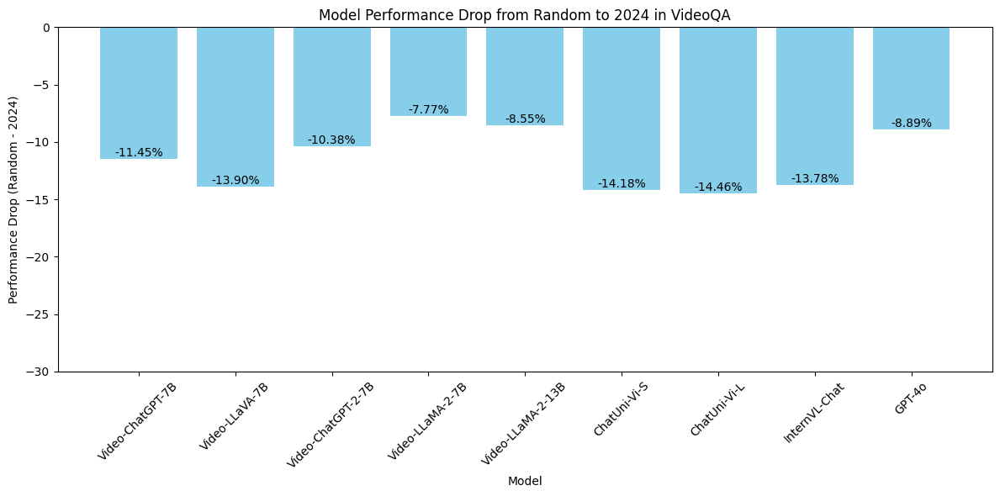

# TaskMeAnything


<h2 align="center"> Task Me Anything</h2>

<p align="center">
    
<p>

<h2 align="center"> <a href="https://www.task-me-anything.org/">🌐 Website</a> | <a href="https://arxiv.org/abs/2406.11775">📑 Paper</a> | <a href="https://huggingface.co/collections/jieyuz2/taskmeanything-664ebf028ab2524c0380526a">🤗 Huggingface</a> | <a href="https://huggingface.co/spaces/zixianma/TaskMeAnything-UI">💻 Interface</a></h2>
    
<h5 align="center"> If you like our project, please give us a star ⭐ on GitHub for latest update.  </h2>


## 🔔News
 **🔥[2024-08-03]: TaskMeAnything-v1-2024 released! A benchmark for reflecting the current progress of MLMs by `automatically` finding tasks that popular MLMs struggle with using the `TaskMeAnything Top-K query and query approximation algorithms`. This includes [12,270 ImageQA](https://huggingface.co/datasets/weikaih/TaskMeAnything-v1-imageqa-2024) and [3,567 VideoQA](https://huggingface.co/datasets/weikaih/TaskMeAnything-v1-videoqa-2024) questions that TaskMeAnything automatically approximated as challenging.**
 
 **🔥[2024-07-04]: Demo for TaskMeAnything released! checkout our demo for [generating customized ImageQa, VideoQA benchmarks](https://github.com/JieyuZ2/TaskMeAnything/tree/main/demo/generate) and [model evaluation query](https://github.com/JieyuZ2/TaskMeAnything/tree/main/demo/query)!**
 
 **🔥[2024-06-17]: Paper arXived!**
 
 **🔥[2024-06-01]: Code released!**

## What's TaskMeAnything?
TaskMeAnything is a benchmark generation engine which produces a benchmark for large multimodal language models (MLMs) tailored to a user's needs. 
In particular, name maintains an extendable taxonomy of visual assets and can programmatically generate a vast number of task instances. 
Additionally, it algorithmically addresses user queries regarding MLM performance efficiently within a computational budget. 
The current version can generate > 750M image/video question-answering pairs, which focus on evaluating MLM perceptual capabilities.

:exclamation: **TaskMeAnything does NOT involve any AI model during image/video, question, and answer generation, so the generated tasks do NOT suffer from model imperfection or hallucinations.**

We release the following resources: 
1. [**TaskMeAnything-v1**](https://github.com/JieyuZ2/TaskMeAnything): the first version of TaskMeAnything, includes 28 task generators which can generate over 750M VQA task.
2. **TaskMeAnything-v1-Random**[[ImageQA](https://huggingface.co/datasets/weikaih/TaskMeAnything-v1-imageqa-random)|[VideoQA](https://huggingface.co/datasets/weikaih/TaskMeAnything-v1-videoqa-random)]: A randomly selected from TaskMeAnything-v1, including 5,700 ImageQA and 1,800 VideoQA task instances.
3. **TaskMeAnything-v1-2024**[[ImageQA](https://huggingface.co/datasets/weikaih/TaskMeAnything-v1-imageqa-2924)|[VideoQA](https://huggingface.co/datasets/weikaih/TaskMeAnything-v1-videoqa-2024)]: A benchmark for reflecting the current progress of MLMs by `automatically` finding tasks that popular MLMs struggle with using the TaskMeAnything Top-K query and query approximation algorithms. This includes [12,270 ImageQA](https://huggingface.co/datasets/weikaih/TaskMeAnything-v1-imageqa-2024) and [3,567 VideoQA](https://huggingface.co/datasets/weikaih/TaskMeAnything-v1-videoqa-2024) questions that TaskMeAnything automatically approximated as challenging for over 20 popular MLMs.
4. [**TaskMeAnything-DB**](https://huggingface.co/datasets/weikaih/TaskMeAnything-v1-eval-db): A database for TaskMeAnything, which stores the evaluation results of 13 open-source MLMs over 1M VQA task instances.
5. [**TaskMeAnything-UI**](): An interactive graphical interface built upon TaskMeAnything-DB, which allows users to interact with the performance of models on TaskMeAnything-v1 in a intuitve way.

   

## TaskMeAnything-v1

### Usage
Demo for TaskMeAnything released! checkout our demo for 
* [generating customized ImageQa, VideoQA benchmarks](https://github.com/JieyuZ2/TaskMeAnything/tree/main/demo/generate) 
* [model evaluation query](https://github.com/JieyuZ2/TaskMeAnything/tree/main/demo/query)
  
Notice: If you want to evaluate videoqa models, please check our [videoqa model branch](https://github.com/JieyuZ2/TaskMeAnything/tree/videoqa_model)


### Installation
You can easily download the repo and set up the environments via:
```
git clone https://github.com/JieyuZ2/TaskMeAnything.git
cd ./TaskMeAnything

pip install -r requirements.txt
```

Notice: if you want to render 3D images/videos by `Blender` locally or use `Internvl-chat-v1.5-24B` that required `flash-attn` which hard to install by pip, you can use the docker image we provide. 
You can pull the docker image from DockerHub which includes all the dependencies like `Blender`, `flash-attn`, `cuda driver`, `nvcc`, etc.
```
docker push weikaih/ubuntu20.4_internvl_blender_v1.2:latest
docker run --gpus all -it weikaih/ubuntu20.4_internvl_blender_v1.2:latest /bin/bash # run the docker image with GPU support

git clone https://github.com/JieyuZ2/TaskMeAnything.git
cd ./TaskMeAnything

pip install -r requirements.txt
```


### Source data
Source data is stored in [HuggingFace](https://huggingface.co/datasets/jieyuz2/TaskMeAnything-v1-source). It includes `3d_assets`, `agqa_video`, and `object_images`.

For real image with scene graphs, please download the images and scene graphs from the following links: [SceneGraph](https://downloads.cs.stanford.edu/nlp/data/gqa/sceneGraphs.zip), [Image](https://downloads.cs.stanford.edu/nlp/data/gqa/images.zip). 
After downloading, move the scene graphs and images into the source data folder, and arrange them as format below.
```
TaskMeAnything-v1-source/vg/sceneGraphs: move scene graphs files to this folder (e.g. TaskMeAnything-v1-source/vg/sceneGraphs/train_sceneGraphs.json).
TaskMeAnything-v1-source/vg/images/images: move all the images to this folder (e.g. TaskMeAnything-v1-source/vg/images/images/2323739.jpg).
```


### Task Generator
We have 28 task generators in TaskMeAnything-v1, across 5 Scenarios:
1. `2D Sticker Image`: grid-how-many, grid-what, grid-where, grid-what-attribute, grid-where-attribute
2. `3D Tabletop Image`: 3d-what, 3d-where, 3d-what-attribute, 3d-where-attribute, 3d-how-many, 3d-what-size, 3d-where-size, 3d-what-attribute-size, 3d-what-distance, 3d-where-distance, 3d-what-attribute-distance
3. `3D Tabletop Video`: video-3d-what-move, video-3d-where-move, video-3d-what-attribute-move, video-3d-what-rotate, video-3d-where-rotate, video-3d-what-attribute-rotate
4. `Real Images`: sg-what-object, sg-what-relation, sg-what-attribute
5. `Real Videos`: video-sg-what-object, video-sg-what-relation, video-sg-what-action

### Tested Models 
We support the following ImageQA and VideoQA models: 
- `ImageQA`: qwenvl-chat, qwenvl, llavav1.5-7b, llavav1.5-13b, instructblip-vicuna7b, instructblip-vicuna13b, internvl-chat-v1.5, gemini-vision-pro, qwen-vl-max, gpt4v, gpt4o
- `VideoQA`: video-llama2-7b, video-llama2-13b, video-llava-7b, chat-univi-7b, chat-univi-13b, video-chatgpt-7b, video-chat2-7b


You can also use our unified vqa interface for inference:
```python
from PIL import Image
from tma.models.qa_model import ImageQAModel
# from tma.models.qa_model.prompt import succinct_prompt
from tma.models.qa_model.prompt import detailed_imageqa_prompt

model = ImageQAModel(
    model_name= "llava-v1.5-7b",
    prompt_name= "detailed",
    prompt_func= detailed_imageqa_prompt
)

image = './path/to/image.jpg'
# or image = Image.open(image_path)
question = "Describe the image."

model.qa(image, question)
```
Or check [videoqa model branch](https://github.com/JieyuZ2/TaskMeAnything/tree/videoqa_model) for videoqa models qa inference.

## TaskMeAnything-v1 Benchmark
Currently, we provide two versions of TaskMeAnything-v1 benchmark:
* TaskMeAnything-v1-Random: [[ImageQA](https://huggingface.co/datasets/weikaih/TaskMeAnything-v1-imageqa-random)|[VideoQA](https://huggingface.co/datasets/weikaih/TaskMeAnything-v1-videoqa-random)]: A randomly selected from TaskMeAnything-v1, including 5,700 ImageQA and 1,800 VideoQA task instances.
* TaskMeAnything-v1-2024: [[ImageQA](https://huggingface.co/datasets/weikaih/TaskMeAnything-v1-imageqa-2924)|[VideoQA](https://huggingface.co/datasets/weikaih/TaskMeAnything-v1-videoqa-2024)]: A benchmark for reflecting the current progress of MLMs by `automatically` finding tasks that popular MLMs struggle with using the TaskMeAnything Top-K query and query approximation algorithms. 

### Load TaskMeAnything-v1 ImageQA Dataset
```python
import datasets
dataset_name = 'weikaih/TaskMeAnything-v1-imageqa-random'
#dataset_name = 'weikaih/TaskMeAnything-v1-imageqa-2024'
dataset = datasets.load_dataset(dataset_name, split = TASK_GENERATOR_SPLIT)
```
where `TASK_GENERATOR_SPLIT` is one of the task generators, eg, `2d_how_many`.


### Load TaskMeAnything-v1 VideoQA Dataset and Convert Video Binary Stream to mp4
* Since Huggingface does not support saving .mp4 files in datasets, we save videos in the format of binary streams. After loading, you can convert the video binary stream to .mp4 using the following method.
```python
import datasets

dataset_name = 'weikaih/TaskMeAnything-v1-videoqa-random'
#dataset_name = 'weikaih/TaskMeAnything-v1-videoqa-2024'
dataset = datasets.load_dataset(dataset_name, split = TASK_GENERATOR_SPLIT)

# example: convert binary stream in dataset to .mp4 files
video_binary = dataset[0]['video']
with open('/path/save/video.mp4', 'wb') as f:
    f.write(video_binary)
```

### Evalution results in TaskMeAnything-v1 benchmark
* ImageQA in Random
<p align="center">
    
<p>

* VideoQA in Random
<p align="center">
    
<p>

* ImageQA in 2024
<p align="center">
    
<p>

* VideoQA in 2024
<p align="center">
    
<p>

* TaskMeAnything-v1-2024 v.s TaskMeAnything-v1-Random
<p align="center">
    
<p>
<p align="center">
    
<p>

* we can see that the performance drops are more significant in the 2024 version, which indicates that the 2024 version is more challenging for the models.


For more details, please check out the [paper](https://arxiv.org/abs/2406.11775).

## TaskMeAnything-DB
**TaskMeAnything-DB** are stored in [HuggingFace](https://huggingface.co/datasets/jieyuz2/TaskMeAnything-v1-db)

## TaskMeAnything-UI
**TaskMeAnything-UI** are hosted in [HuggingFace](todo), check out our interactive interface to explore the performance of models on TaskMeAnything-v1 in your own way!

## Disclaimers
**TaskMeAnything** and its associated resources are provided for research and educational purposes only. 
The authors and contributors make no warranties regarding the accuracy or reliability of the data and software. 
Users are responsible for ensuring their use complies with applicable laws and regulations. 
The project is not liable for any damages or losses resulting from the use of these resources.


## Contact

- Jieyu Zhang: jieyuz2@cs.washington.edu

## Citation

**BibTeX:**

```bibtex
@article{zhang2024task,
  title={Task Me Anything},
  author={Zhang, Jieyu and Huang, Weikai and Ma, Zixian and Michel, Oscar and He, Dong and Gupta, Tanmay and Ma, Wei-Chiu and Farhadi, Ali and Kembhavi, Aniruddha and Krishna, Ranjay},
  journal={arXiv preprint arXiv:2406.11775},
  year={2024}
}
```

